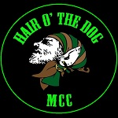
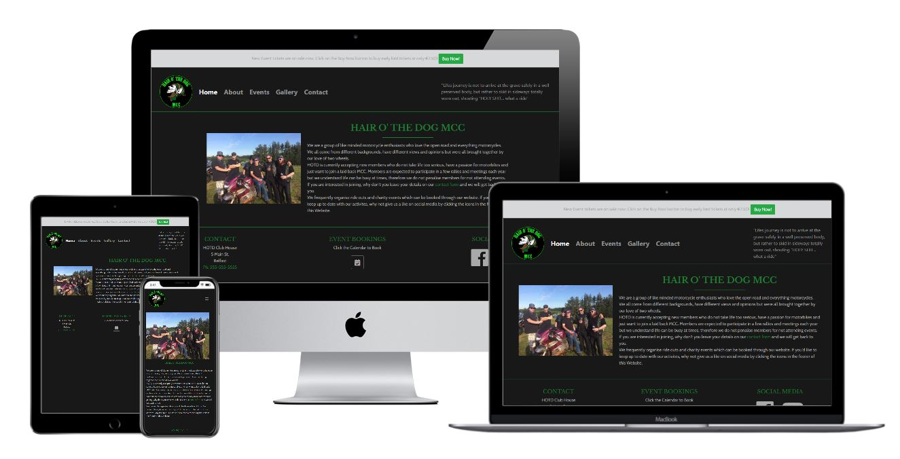
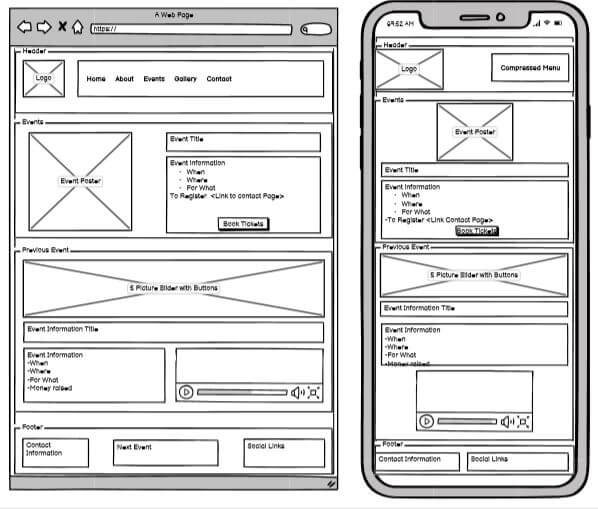
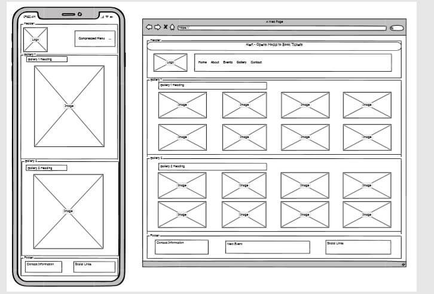

## Table of Contents
* [Purpose](#Purpose)
* [User Experience Design (UX)](#User-Experience-Design)
  * [User stories](#User-Stories)
    * [First Time Visitor Goals](#First-Time-Visitor-Goals)
    * [Returning Visitor Goals](#Returning-Visitor-Goals)
    * [Frequent User Goals](#Frequent-User-Goals)
  * [Structure](#Structure)
  * [Design](#Design)
    * [Colour Scheme](#Colour-Scheme)
    * [Typography](#Typography)
    * [Imagery](#Imagery)
    * [Wireframes](#Wireframes)
* [Limitations](#Limitations)
- [Features](#Features)
    * [Existing Features](#Existing-Features)
    * [Future Features](#Features-Left-to-Implement)
* [Technologies](#Technologies)
* [Testing](#Testing)
* [Deployment](#Deployment)
    * [GitHub Pages](#Using-Github-Pages)
    * [Locally](Run-Locally)
* [Credits](#Credits)
  * [Content](#Content)
  * [Media](#Media)
  * [Acknowledgements](#Acknowledgements)

# Milestone Project 1
## Purpose
This Website was created for the sole purpose of completing the first Milestone Project for the Code Institute's Full Stack Developer course. 
It was built using the knowledge gained from the HTML, CSS and User Centric Design modules. A full list of technologies used can be found in the technologies section of this document.

## Hair O' The Dog MCC (HOTD) Responsive Website

The Hair O' The Dog Motorcycle club Website was built at the request of Club Founder Rocket. The client wanted a fully responsive website that could be used to advertise and showcase their club and all activites. The client wants the ability to increase ticket sales for charity events by selling them though the website. Club information that is critical to the Website for the purpose of recruitment is information on the clubs values and the heirarchy of members. 

The live website can be found [here](https://daisy-mcg.github.io/MilestoneProject-1/index.html).

*** 
## User Experience Design

### User stories
#### First Time Visitor Goals
* As a First Time Visitor, I want to easily understand the main purpose of the site and learn more about the organisation.
* As a First Time Visitor, I want to be able to easily navigate throughout the site to find content.
* As a First Time Visitor, I want to view the website and content clearly on my mobile device.
* As a First Time Visitor, I want to find ways to follow the HOTD Club on different social media platforms.
#### Returning Visitor Goals
* As a Returning Visitor, I want to order tickets online in advance of events so that I am garanteed entry.
* As a Returning Visitor, I want to contact the organisation so I can request more information.
#### Frequent User Goals
* As a Frequent User, I want to check to see if there are any new upcoming events.
* As a Frequent User, I want to check to see if there are any new photos and media from the clubs activities.
* As a Frequent User, I want to sign up to the Newsletter so that I am emailed any major updates and/or changes to the website or organisation.
### Structure
All Pages will contain a Navigation menu at the top of the Webpage that directs them to a new Page to easily allow users to Navigate the site easily.
The Nav Menu will be collapsable on a Mobile device to make use of space on smaller devices.
The purpose of this is to fulfill user story:
> As a First Time Visitor, I want to be able to easily navigate throughout the site to find content.

The Home Page will contain a small bio about the club.
The purpose of this is to fulfill user story:
> As a First Time Visitor, I want to easily understand the main purpose of the site and learn more about the organisation.

Custom CSS and/or Bootstrap will be used to make the Website responsive by the use of media queries and/or the Boostrap Grid system.

All pages will be responsive and the layouts will change dependant on screen size. This is to ensure content flow is appealing,
images are displayed properly and that the content is not shrunk side by side, so small that it is unreadable.
The purpose of this is to fulfill user story:
> As a First Time Visitor, I want to view the website and content clearly on my mobile device.

All pages will contain a Footer Element with Contact Information, Event Booking and Social Media Icons. The icons used will be
from font-awesome. These are referenced below in the Frameworks-Libraries-and-Programs-Used section of this document. The event 
Booking section will not be visible on smaller devices. The aim of the Footer elements are to fulfill user stories:
> As a First Time Visitor, I want to find ways to follow the HOTD Club on different social media platforms. 
> As a Returning Visitor, I want to order tickets online in advance of events so that I am garanteed entry. 
> As a Returning Visitor, I want to contact the club so I can request more information.

The About Page will contain The History of the Club, their current members, titles and personal bios. This page is to help 
implement user story:
> As a First Time Visitor, I want to easily understand the main purpose of the site and learn more about the organisation.

The Events Page will contain information on upcoming and previous events run by the Club. There will be a booking form 
connected to this page. 
The purpose of this is to fulfull user stories:
> As a Returning Visitor, I want to order tickets online in advance of events so that I am garanteed entry. 
> As a Frequent User, I want to check to see if there are any new upcoming events.

The Gallery Page will contain several Galleries with 8 photographs in each from various activities the club has engaged in.
The purpose of these galleries are to fulfill user story:
> As a Frequent User, I want to check to see if there are any new photos and media from the clubs activities.

The Contact Page will contain a form that can be used to contact the Club through the website. This will also contain a check 
box that will allow the user to sign up for the Clubs newsletter in order to keep up to date with the club.
The purpose of this Page is to fulfill user stories:
> As a Returning Visitor, I want to contact the organisation so I can request more information. 
> As a Frequent User, I want to sign up to the Newsletter so that I am emailed any major updates and/or changes to the website or organisation.

Throughout the desktop version of the website there will also be an alert at the top of all pages except the Events Page. This
can be engaged with by the user. The resulting action will open up a modal form to allow the user to book event tickets.
### Design
#### Colour Scheme
The two main colours used are Green (#1e7e34) and Black (#181818) as per HOTD Club colours.
#### Typography
The headers on all pages throughout the Website are using the **Libre Baskerville** font while the main text is using the **Cabin** font. 
#### Imagery
Brand is important to HOTD and they have provided their own Logo to be used in the Nav section of the website that will be displayed at all
times no matter the device. The size and placement may vary dependant on screen size. Photo's of club members and events will be present throughout the Website. These images have been provided by the club's found Ronnie Robinson.
#### Wireframes
Home Page 
 
About Page 
 
Event Page 
 
Gallery Page 
 
Contact Page 
 

For full side PDF's of the wireframes, please click the links below
* [Home Page Wireframe](assets/wireframes/home.pdf)

* [About Page Wireframe](assets/wireframes/about.pdf)

* [Events Page Wireframe](assets/wireframes/events.pdf)

* [Gallery Page Wireframe](assets/wireframes/home.pdf)

* [Contact Page Wireframe](assets/wireframes/home.pdf)
### Limitations
Due to no JavaScript functionality, apart from Bootstraps(JS/JQuery) used for the Modal Form as outlined in the Frameworks Libraries and 
Programs Used section, the contact forms will not store data or send email requests.
***
## Features
 
### Existing Features
- Alert on Desktop view (Alert present on index.html, about.html, gallery.html, contact.html) - This alert allows users to Book event tickets by opening up a modal form.
- Booking button on the events.html page opens up the booking modal form (The same one as the alert)
- Contact Form - This can be completed on the contact.html page and used in order to contact the club with any queries users may have.
- Carousel Gallery - There are 4 carousel sliders within the Website. One is on the Event Page displaying a few slides from a successfull fundraiser for Lifeline Inishowen. The remaining three are on the Gallery Page and are only displayed on small screen sizes to prevent the need for excessive scrolling.
- Embedded YouTube video - This past event video can be turned on/off by the user. It is not set to automatically run.

### Features Left to Implement
- Users would like to have a forum encorporated into the Website. This feature was not impletemented as part of the initial release but will be addressed in a future.
- In order to impletement the use of the proposed forum, signup and logins would have to be added.
***
## Technologies

* HTML
	* This project uses HTML as the main language used to complete the structure of the Website.
* CSS
	* This project uses custom written CSS to style the Website.
* [Bootstrap](https://getbootstrap.com/)
	* The Bootstrap framework is used throughout this website for layouts and styling.
	* This has also been used to import JavaScript/Query used for the pop up Event booking modal
* [Font Awesome](https://fontawesome.com/)
	* Font awesome Icons are used for the Social media links contained in the Footer section of the website.
* [Google Fonts](https://fonts.google.com/)
	* Google fonts are used throughout the project to import the *Libre Baskerville* and *Cabin* fonts.
* [Visual Studio Code](https://code.visualstudio.com/)
	* VS Code is the Integrated Development Environment used to develop the Website.
* [GitHub](https://github.com/)
	* GithHub is the hosting site used to store the source code for the Website and [Git Pages](https://pages.github.com/) is used for the deployment of the live site.
* Git
	* Git is used as version control software to commit and push code to the GitHub repository where the source code is stored.
* [TinyJPG](https://tinyjpg.com/)
	* TinyJPG is used to reduce the file sizes of images before being deployed to reduce storage and bandwith.
* Google Chrome Developer Tools
	* Google chromes built in developer tools are used to inspect page elements and help debug issues with the site layout and test different CSS styles.
* [balsamiq Wireframes](https://balsamiq.com/wireframes/)
	* This was used to create wireframes for 'The Skeleton Plane' stage of UX design.
* MS PAINT
    * The dropper tool is this program was used against the Site logo to determine the exact shade of green to be used.
* [CSS Generator](https://cssgenerator.org/rgba-and-hex-color-generator.html)
    * This was used to convert the RGBA colour for the site to Hex. 
* [Favicon](https://favicon.io/)
    * Favicon.io was used to make the site favicon 
* [Techsini](http://techsini.com/multi-mockup/index.php)
    * tecnisih.com Multi Device Website Mockup Generator was used to create the Mock up image in this README
***
## Testing

In this section, you need to convince the assessor that you have conducted enough testing to legitimately believe that the site works well. Essentially, in this part you will want to go over all of your user stories from the UX section and ensure that they all work as intended, with the project providing an easy and straightforward way for the users to achieve their goals.

Whenever it is feasible, prefer to automate your tests, and if you've done so, provide a brief explanation of your approach, link to the test file(s) and explain how to run them.

For any scenarios that have not been automated, test the user stories manually and provide as much detail as is relevant. A particularly useful form for describing your testing process is via scenarios, such as:

1. Contact form:
    1. Go to the "Contact Us" page
    2. Try to submit the empty form and verify that an error message about the required fields appears
    3. Try to submit the form with an invalid email address and verify that a relevant error message appears
    4. Try to submit the form with all inputs valid and verify that a success message appears.

In addition, you should mention in this section how your project looks and works on different browsers and screen sizes.

You should also mention in this section any interesting bugs or problems you discovered during your testing, even if you haven't addressed them yet.

If this section grows too long, you may want to split it off into a separate file and link to it from here.
***
## Deployment

### Using Github Pages
1. Navigate to the GitHub Repository: https://github.com/Daisy-McG/MilestoneProject-1
1. Click the 'Settings' Tab.
1. Scroll Down to the Git Hub Pages Heading.
1. Select 'Master Branch' as the source.
1. Click the Save button
1. Click on the link to go to the live deployed page

### Run Locally
1. Navigate to the GitHub Repository: https://github.com/Daisy-McG/MilestoneProject-1
1. Click the Code drop down menu
1. Either Download the ZIP file, unpackage locally and open with IDE (This route ends here) OR Copy Git URL from the dialogue box
1. Open your developement editor of choice and open a terminal window in a directory of your choice
1. Use the 'git clone' command in terminal followed by the copied git URL
1. A clone of the project will be created locally on your machine

***
## Credits
### Code
The code to style the check-box background color was taken from [Stackoverflow](https://stackoverflow.com/questions/24322599/why-cannot-change-checkbox-color-whatever-i-do)
### Content
The content of this software was created by Daisy McGirr based upon discussions with Ronnie Robinson, Hair O' The Dog MCC.

### Media
The photos and video used in this video are property of Hair O' The Dog MCC. Permission was granted to use all media files by Ronnie Robinson, club Founder.
The YouTube video on the events page is property of Marijus Ltu. Permission was obtained to use this video.

### Acknowledgements

I'd like to thank my mentor Spencer Baribell for his guidance throughout my project. 
Thanks to fellow classmate @Jay Bradley for helping me figure out how to link my TOC to headings with spaces.
I'd like to give a special mention to past students Anthony and Mr_Bim_alumni who guided me and helped me learn to debug with developer tools whenever I faced alignment issues with my Website.